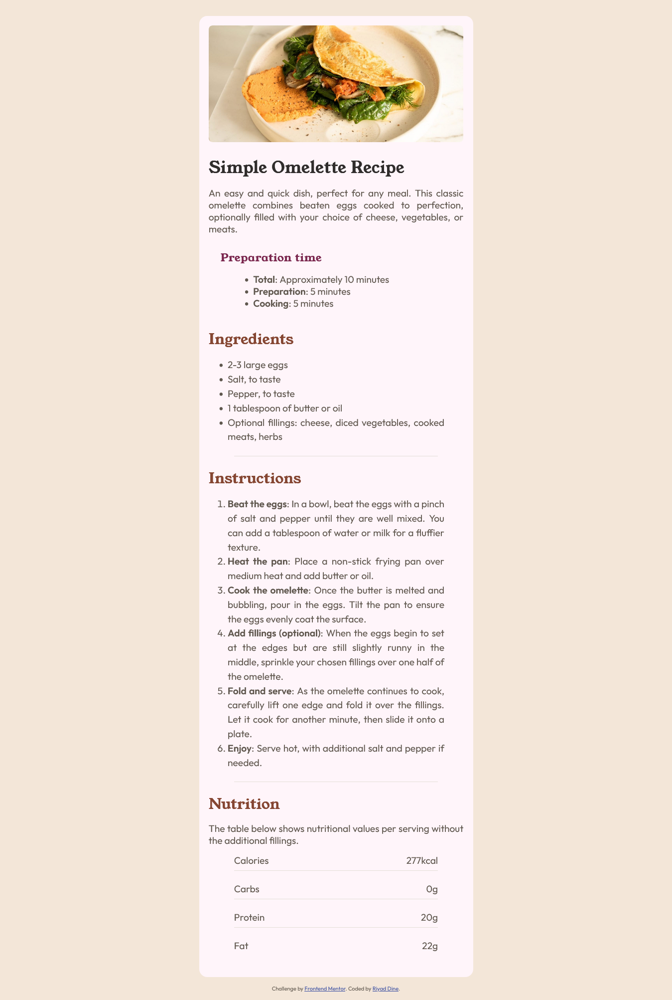

# Frontend Mentor - Recipe page solution

This is a solution to the [Recipe page challenge on Frontend Mentor](https://www.frontendmentor.io/challenges/recipe-page-KiTsR8QQKm). Frontend Mentor challenges help you improve your coding skills by building realistic projects. 

## Table of contents

- [Frontend Mentor - Recipe page solution](#frontend-mentor---recipe-page-solution)
  - [Table of contents](#table-of-contents)
  - [Overview](#overview)
    - [Screenshot](#screenshot)
    - [Links](#links)
    - [Built with](#built-with)
  - [Author](#author)

## Overview

A solution that presents cooking instructions, ingredient lists, and tips for making a specific dish.

### Screenshot

### Links

- Solution URL: (https://github.com/riyadDine/Recipe-page-repo)
- Live Site URL: (https://riyaddine.github.io/Recipe-page-repo/)

### Built with

- Semantic HTML5 markup
- CSS custom properties
- Mobile-first workflow

## Author

- Frontend Mentor - [@riyadDine](https://www.frontendmentor.io/profile/riyadDine)
